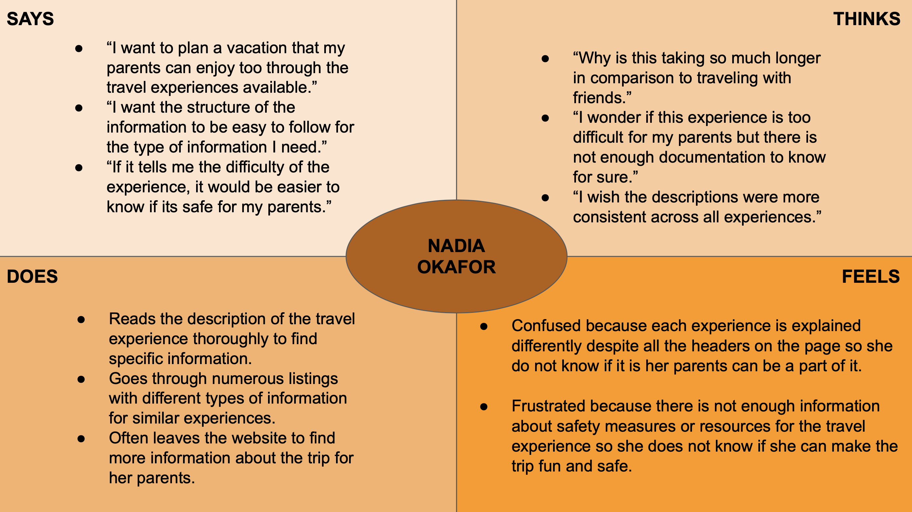
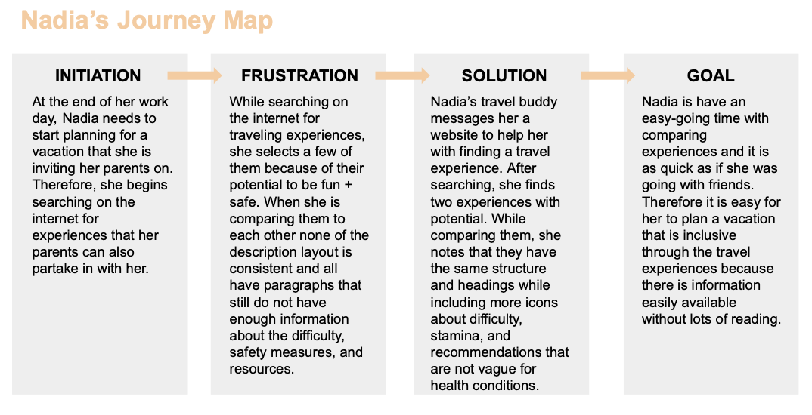

# Assignment 3 - Contextual Inquiry 
## by Gloria Rodriguez for Digital Humanities 110 (Spring 2021)

### Purpose of UX Storytelling 
> The importance of user experience storytelling on a digital landscape is to allow developers during the design process to address the user's needs and aspirations by better empathizing with the user by curating persona's from user research. During this stage it also exposes the dissatisfaction and problems user's face who have different experiences and backgrounds. Also it assists the designers who are collobarating together help better intergrate new design features with the same persona in mind. 

### Design Features 
The two following features being integrated from prior user research are:
> **Travel experience description page**

> **Travel experience search query**

---

### Personas & Empathy Maps

#### Nadia - Persona

#### Nadia - Empathy Map

#### Gerald - Persona
Insert the image.

#### Gerald - Empathy Map
Insert the image. 

---
### User Scenerios & Journey Maps

#### Nadia 
**Why is Nadia using the product** 
> Nadia is a laboratory technician who has been imployed for a little over a year so she has paid-timed-off (pto) that she wants to use to go on a trip with her parents. She wants to make it inclusive as posssible since they are older by planning experiences that are safe for them while having fun too. After requesting the time off, she wants to look into what experiences can they all partake in. Therefore, Nadia decided to look at what kinds of things they can do by looking online at consise descriptions. Her priority is to find inclusive experiences that her parents can do by keeping their stamina and other health conditions in mind to curate a fun and safe time on vacation.

**How is Nadia using the product** 
> After destressing from a long day at work, Nadia decides to search the internet with a country in mind and specific dates for experiences that her and her family would find fun as well as safe. Easily finding an experience that peaked her parents interests, she clicks on the title to lead to the travel experience description page. Not only was it well-organized by including headers and consise descriptions. It also included icons for more information in regards to the difficulty of the experience and any relevent information for people with certain health backgrounds. Therefore, it was not an effortfull experience since she did not have to parse through huge paragraphs that contained minimal information she needed so she was easily able to click on the booking tab after showing the experience to her parents.

#### Gerald 
**Why is Gerald using the product** 
> Here

**How is Gerald using the product** 
> Here

Insert map here.
