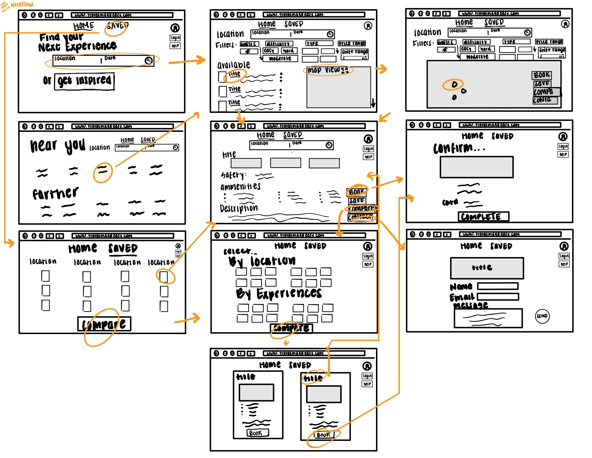
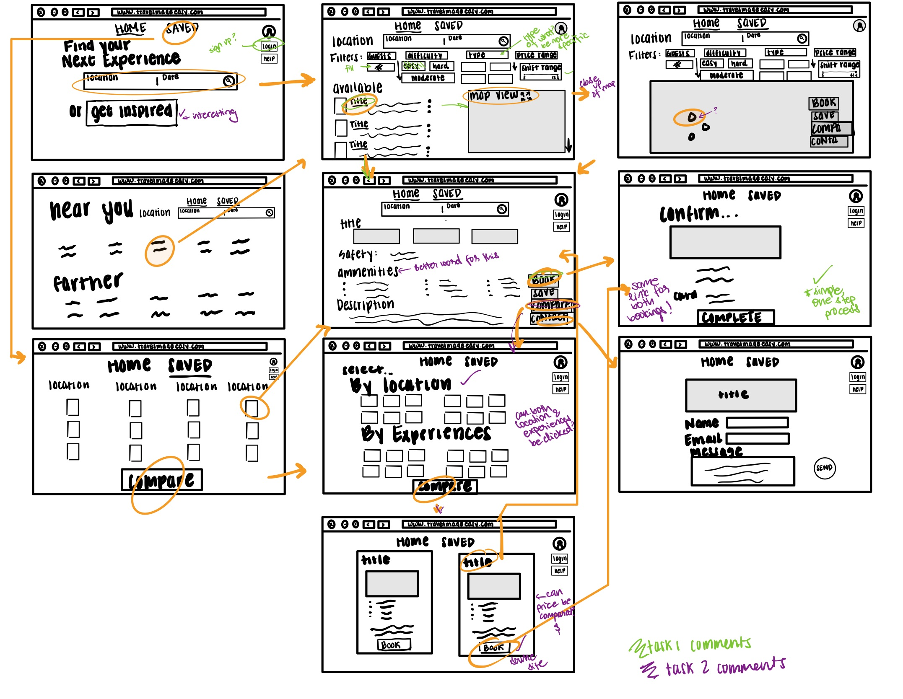

# Assignment 5 - Low-Fidelity Prototype
## by Gloria Rodriguez for Digital Humanities 110 (Spring 2021)

### Brief Summary

#### Purpose
> The purpose for developing and testing the following low-fidelity prototype is to help visualize the design of features that will be employed for future use by the target user population.

#### User Personas:
> The user personas that were curated from user research have: that I have identified can be characterized by the following: desire to travel with friends, family, or just themselves, book travel experiences with specific accomodational needs, be of any age, a need for a soultion to help with finding travel experiences easily rather than struggling, can have little experience to being tech savvy in regards to navigating the website.

#### Features & Tasks:
> The tasks, the travel experience description page and the travel experience search query, are going to be integrated on the following low-fidelity prototype are going to be tested were developed through conducting prior user research that involves usability testing from competing websites such as Airbnb, Tripadvisor, and Expedia, facilitating a contextual inquiry of a target user, and observation notes that were written during these various methods for feature integration such as more standardization across descriptions like icons, safety, and ability to compare.

---

### Wireframes & Wireflows

File: https://drive.google.com/file/d/1rKumdADs4Wx6N40-2gtO1sTZszHhQzjO/view?usp=sharing

---

### Testing Wireflows
> **Video:** https://youtu.be/BI0wKam9l0Y

File: https://drive.google.com/file/d/1lehvYZ6bkCSwU-fTMw50LJAr8idHy10O/view?usp=sharing

#### First Task: Travel experience description page (Green)
> **Tester’s confusion or unexpected interactions:** 

> **Task Completion Status:** 

#### Second Task: Travel experience search query (Purple)
> **Tester’s confusion or unexpected interactions:** 

> **Task Completion Status:** 

---

### Reflection

**Summary:**

**Future Changes for feedback:**
