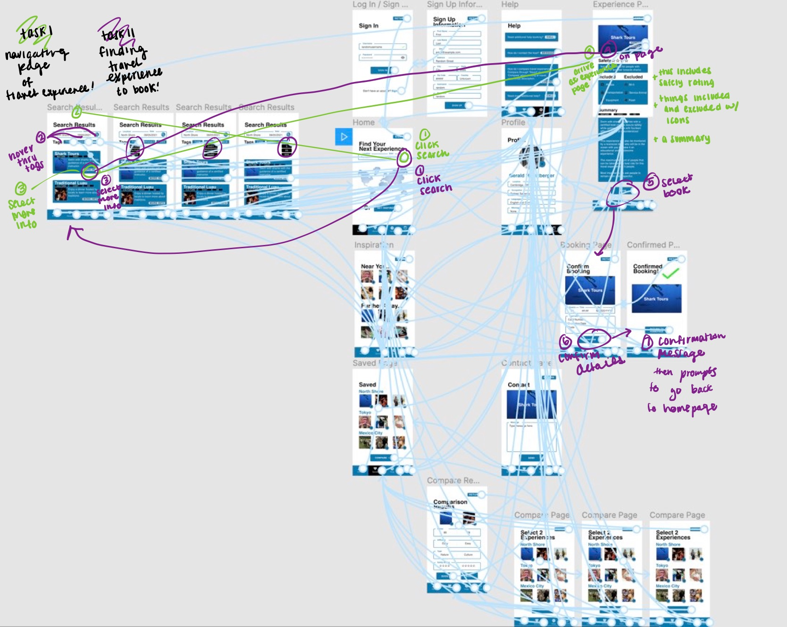
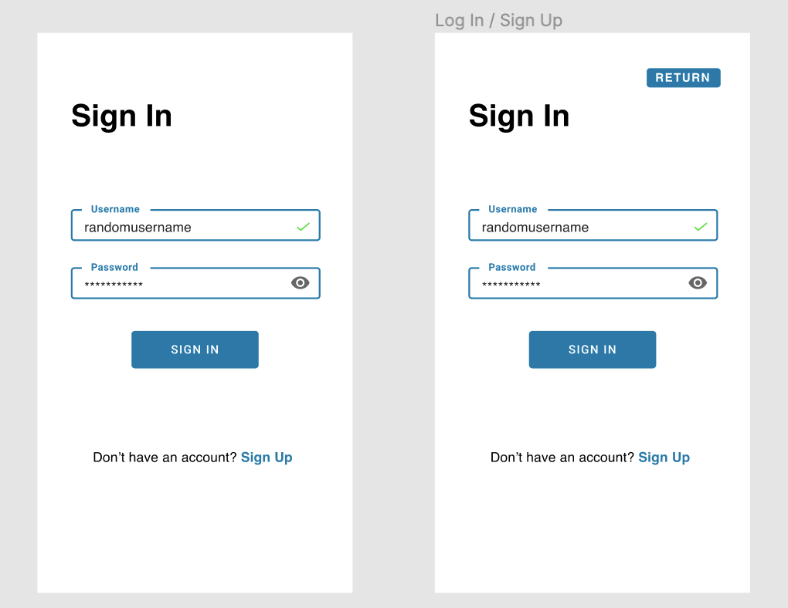
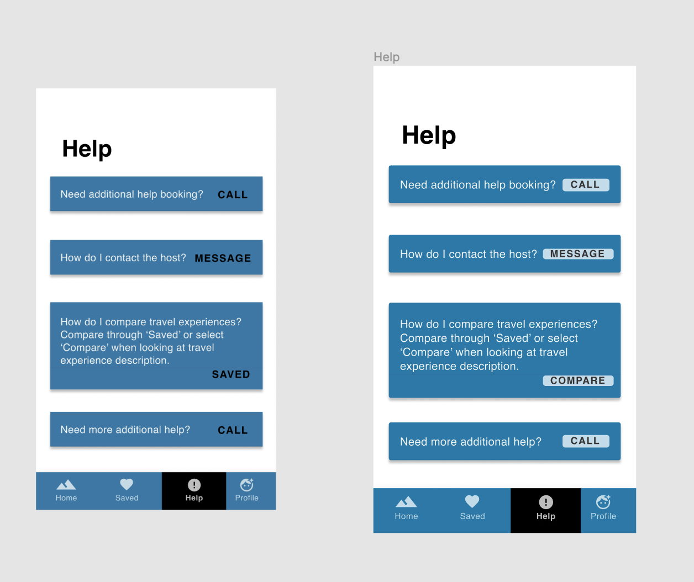

# Assignment 6 - High-Fidelity Prototype Part I & II (Yellow & Blue)
## by Gloria Rodriguez for Digital Humanities 110 (Spring 2021)

### 🟡 Description of Project

#### Summary 
> Planning a vacation with family is challenging when accessibility becomes a major issue in regards to booking experiences because a multitude of factors have to be considered such as mobility and stamina in regards to elderly people. Therefore my project would help people plan a trip that is inclusive to everyone in their group by factoring in things that are not commonly seen on current travel booking sites through a mobile-app that all ages can use to have a fun and safe vacation.

#### Process of High-Fidelity
> The process of curating a high-fidelity prototype consisted of further developing the lo-fi wireframes and solving the errors that erised by designing more frames to include more affordances for the user that were not there prior and still maintain strengths of certain features on Figma. After this step, the layout was selected for a mobile phone which included integrating the gestalt principle of proximity to make surer things that were clustered near each other were related and establish consistancy in design across all the wireframes. Additionally, an impressions test was facilitated to help contextualized these things better. Then the typeface and size were selected to enforce consistency too but also account for legibility as well. Lastly, the colors were choosen and experimented through an iterative process using color-contrast checks to increase accessibility while desgning on the mobile app. 

#### Purpose of High-Fidelity Prototype 
> The purpose of the high-fidelity prototype is to help with the later stages of user usability, design assets, and user flow because it will help contextualize any of these issues because during it will be easily identifiable unlike lo-fi wireframes. Also, the function of a hi-fidelity protype is to help stimulate what the final product would look like which can help assure the project meeting the goal of being able to easily plan an inclusive vacation via travel experience activities that people of all ages can partake in. 

#### The tasks the prototype demonstrates
> The tasks that the prototype demonstrates are navigating the travel experience description page and finding a travel experience to book. It is important to note that the following User Interface components are a gist of what the general aesthetic would be like in order to increase user-friendliness to afford these tasks in an efficient manner and assist with troubleshooting in a way for everyone to understand.

---

### 🟡 Screen design

#### Material UI Component

> Link: https://www.figma.com/file/1Z4uOooQoil2pwlAg4809N/DH-Assignment-6?node-id=0%3A1

#### 3 Different Color Variations

From left to right is the original, dark mode, darkest mode, and bedtime mode.

> Link: https://www.figma.com/file/1Z4uOooQoil2pwlAg4809N/DH-Assignment-6?node-id=0%3A1

---

### 🟡 Impressions Test

#### Video 
> Link: None since it was conducted with my group during lecture :) 

> Summary of findings: Based on the findings from two of my classmates, they easily recognized the purpose of the project which is to help with travel plans through experiences and find events that are going on near the area they are in as well as catering to the elderly population. They suggusted to include features to afford going back to the previous page. Additionally, they suggusted minimizing the amount of elements that were included in the low-fi wireframe that was using a frame for a macbook pro in order to translate it well into a mobile app that will be easy to navigate. 

---

### 🟡 Accessibility (color-contrast) check

> Link: https://www.figma.com/file/1Z4uOooQoil2pwlAg4809N/DH-Assignment-6?node-id=0%3A1

---

### 🟡 Design System 

#### Typeface family + Size
> The typeface family is **Helvetica** and the font size for the headers that are in bold are **size 36** and all other text is **size 16**. 

> Reasoning: Helvetica was selected because it is one of the most commonly used since it is very legible so I decided to hold it constant for the design to prevent any confusement. Therefore it should be easy for the users to identify where the headers are and recognize what the page signifies. Additionally, the size difference between the headers and the other text size is to easily distinguish them from each other. 

#### Color Scheme: Background + Primary (default text) + Focus 
> The color scheme involves a white background with a very minimalistic design which is accompanied by the primary default text of Helvetica throughout that may very in color, and the focus regarding the buttons remains a constant blue tone to support accessibility and affordances via color signifier. Lastly, whenever a user is on a certain page, it will be signified by the black tone at the bottom of the navigation bar.

> Reasoning: The reasoning for a white background is because it helps facilitate a clean fresh look that enables successful contrast in order to increase the accessibility aspects of the design which is very important. It also a reason why sometimes the default text sometimes changes color too. Additionally, a cool shade of blue was integrated through the entirety of the design to help orient the focus of the user by making the buttons easilt recognizable. For the user to recognize which page they are on it was a different color such as Black to help prevent confusion.

#### Layout grid + Spacing 
> The layout grid is based on the figma frames used in design for iPhone 8. Specifically, the type of layout used had 20px margins and by enforcing a layout grid with horizontal lines it was easier to evenly space out elements which are approximately 40px apart if the elements are unrelated and if they are related it is a lot smaller such as 20px. 

> Reasoning: This is very important to hold these standards across especially in regards to spacing because of Gestalt principles, specifically proximity because when things are close to one another they are percieved to be more related to one another than things that are spaced far apart. In addition to being mindful about this it helped organize the elements much more effeciently for the user to understand. The margins were kept at 20px because it will help with legibility to support a clean minimalistic design.

---

### 🔵 Interactive Prototype 

Link: https://www.figma.com/proto/1Z4uOooQoil2pwlAg4809N/DH-Assignment-6?node-id=66%3A1517&scaling=scale-down&page-id=0%3A1

---

### 🔵 Wireflow (Diagram)

#### Link: https://www.figma.com/file/1Z4uOooQoil2pwlAg4809N/DH-Assignment-6?node-id=0%3A1

---

### 🔵 Cognitive Walkthrough 
> Evidence: Google survey done during lecture. 

> Summary of findings: Based on facilitating a cognitive walkthrough with four of my classmates, they easily recognized what the purpose of the mobile application was for which was for traveling and the type of services. In addition, the hypothesized that they were able to interact with it too in order to book a travel experience. One thing they also pointed out was that I was missing the option to go back on certain pages as well. Other than that the experience was great for all four of my classmates and agreed that things were going to go much more smoothly once these things were fixed.

---

### 🔵 Reflection 

#### Summary
> Summary.

#### Changes
> From the input I received from the prototype testing, I would definetely add in more buttons that afford the user to go back and forth between pages easily. In addition, I need to make sure things are consistent throughout the entire prototype like the buttons that are included in the help page specifically. 

---

### 🔵 Changes Made  

Based on the feedback from impressions test and the cognitive walkthrough I placed more return buttons to enable the user to go back and forth between pages more easily. Below is the before and after of one page (this applies to other pages too).

Additionally, the feedback that I recieved after submitting the first portion (yellow) it was recommended for me to redesign the help given that the affordances were not clear. Therefore, I inserted more buttons and changed the font color to help better indicate that the buttons afford clicking. Below is the before and after.

