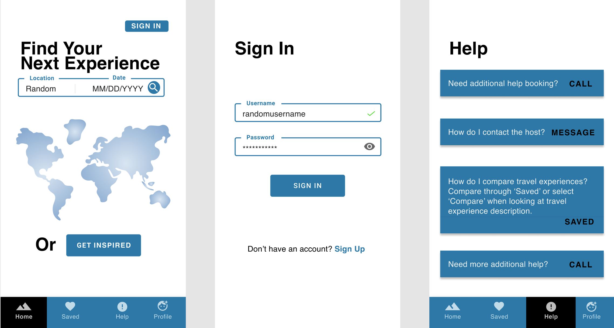
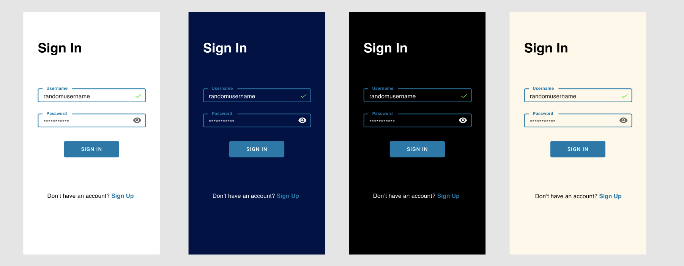
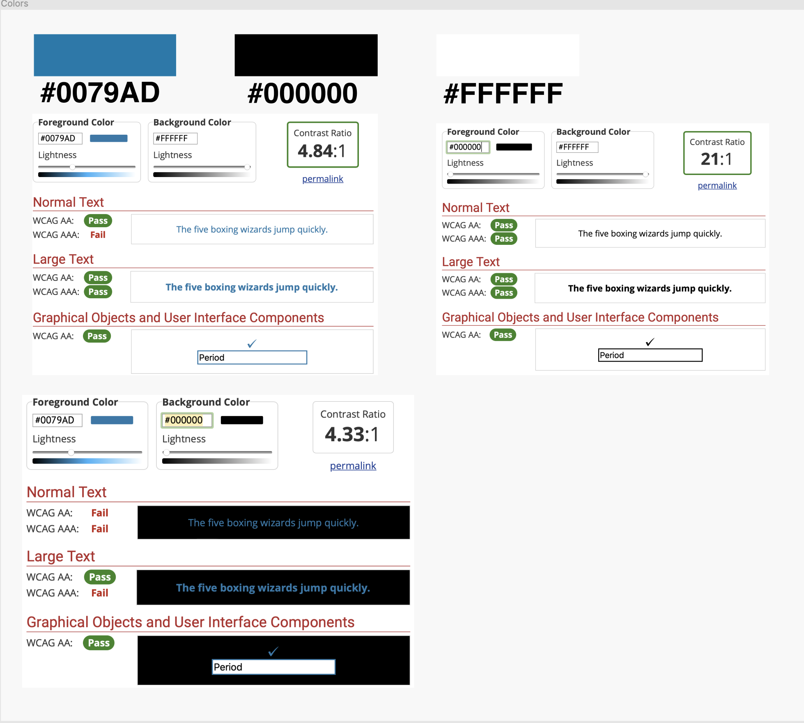

# Assignment 6 - High-Fidelity Prototype Part I (Yellow)
## by Gloria Rodriguez for Digital Humanities 110 (Spring 2021)

### 🟡 Description of Project

#### Summary 
> Text.

#### Process of High-Fidelity
> Text.

#### Purpose of High-Fidelity Prototype 
> Text.

#### The tasks the prototype demonstrates
> Text.

---

### 🟡 Screen design

#### Material UI Component

> Link: https://www.figma.com/file/1Z4uOooQoil2pwlAg4809N/DH-Assignment-6?node-id=0%3A1

#### 3 Different Color Variations

> Link: https://www.figma.com/file/1Z4uOooQoil2pwlAg4809N/DH-Assignment-6?node-id=0%3A1

---

### 🟡 Impressions Test

#### Video 
> Link: 

> Summary of findings: 

---

### 🟡 Accessibility (color-contrast) check

> Link: https://www.figma.com/file/1Z4uOooQoil2pwlAg4809N/DH-Assignment-6?node-id=0%3A1

---

### 🟡 Design System 

#### Typeface family + Size
> The typeface family is **Helvetica** and the font size for the headers that are in bold are **size 36** and all other text is **size 16**. 

> Reasoning: Helvetica was selected because it is one of the most commonly used since it is very legible. Therefore it should be easy for the users to identify where the headers are and recognize what the page signifies. Additionally, the size difference between the headers and the other text size is to easily distinguish them from each other. 

#### Color Scheme: Background + Primary (default text) + Focus 
> The color scheme involves a ___ background, accompanied by the primary default text of ___ , and the focus is ___ . 

> Reasoning:

#### Layout grid + Spacing 
Insert a picture.

> The layout grid is ___ + spacing is . 

> Reasoning: 

