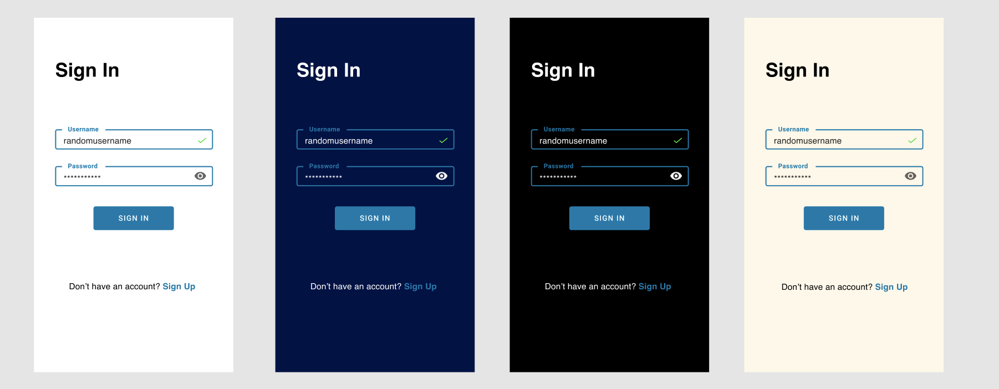
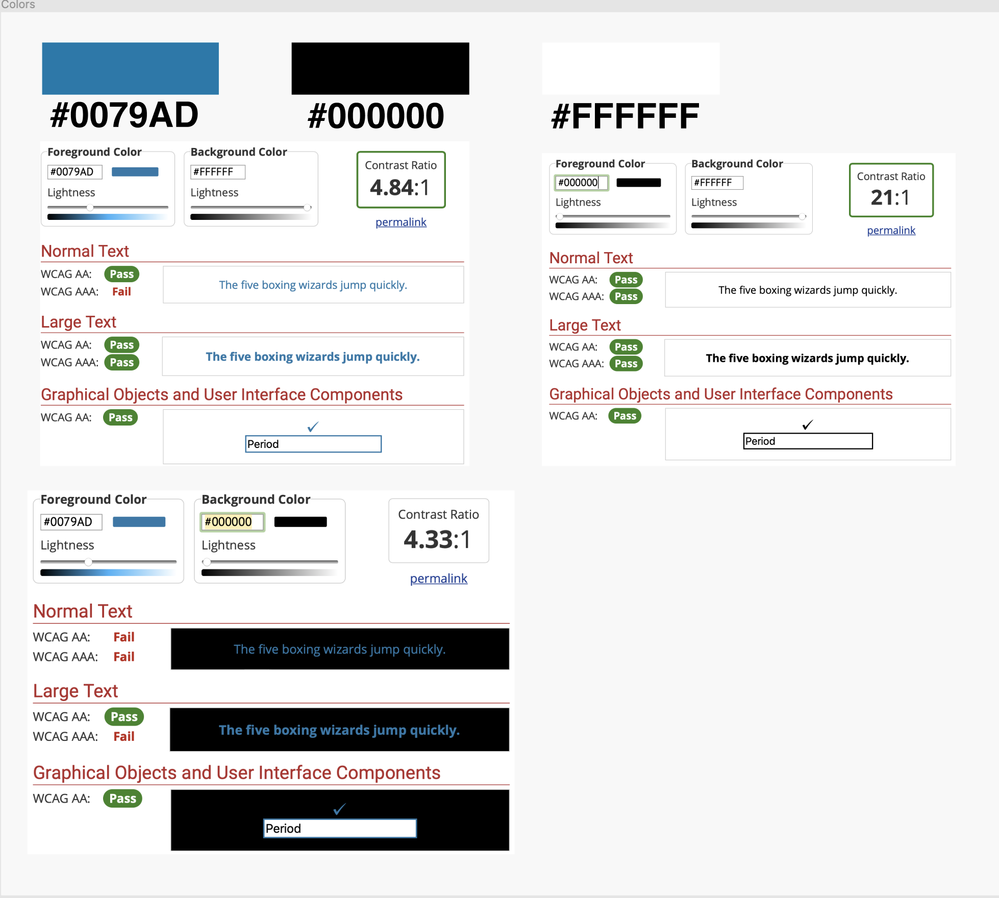

# Assignment 6 - High-Fidelity Prototype Part I (Yellow)
## by Gloria Rodriguez for Digital Humanities 110 (Spring 2021)

### 🟡 Description of Project

#### Summary 
> Text.

#### Process of High-Fidelity
> Text.

#### Purpose of High-Fidelity Prototype 
> Text.

#### The tasks the prototype demonstrates
> Text.

---

### 🟡 Screen design

#### Material UI Component

> Link: https://www.figma.com/file/1Z4uOooQoil2pwlAg4809N/DH-Assignment-6?node-id=0%3A1

#### 3 Different Color Variations

From left to right is the original, dark mode, darkest mode, and bedtime mode.

> Link: https://www.figma.com/file/1Z4uOooQoil2pwlAg4809N/DH-Assignment-6?node-id=0%3A1

---

### 🟡 Impressions Test

#### Video 
> Link: None since it was conducted with my group during lecture :) 

> Summary of findings: 

---

### 🟡 Accessibility (color-contrast) check

> Link: https://www.figma.com/file/1Z4uOooQoil2pwlAg4809N/DH-Assignment-6?node-id=0%3A1

---

### 🟡 Design System 

#### Typeface family + Size
> The typeface family is **Helvetica** and the font size for the headers that are in bold are **size 36** and all other text is **size 16**. 

> Reasoning: Helvetica was selected because it is one of the most commonly used since it is very legible so I decided to hold it constant for the design to prevent any confusement. Therefore it should be easy for the users to identify where the headers are and recognize what the page signifies. Additionally, the size difference between the headers and the other text size is to easily distinguish them from each other. 

#### Color Scheme: Background + Primary (default text) + Focus 
> The color scheme involves a white background with a very minimalistic design which is accompanied by the primary default text of Helvetica throughout that may very in color, and the focus regarding the buttons remains a constant blue tone to support accessibility and affordances via color signifier. Lastly, whenever a user is on a certain page, it will be signified by the black tone at the bottom of the navigation bar.

> Reasoning: The reasoning for a white background is because it helps facilitate a clean fresh look that enables successful contrast in order to increase the accessibility aspects of the design which is very important. It also a reason why sometimes the default text sometimes changes color too. Additionally, a cool shade of blue was integrated through the entirety of the design to help orient the focus of the user by making the buttons easilt recognizable. For the user to recognize which page they are on it was a different color such as Black to help prevent confusion.

#### Layout grid + Spacing 
> The layout grid is based on the figma frames used in design for iPhone 8. Specifically, the type of layout used had 20px margins and by enforcing a layout grid with horizontal lines it was easier to evenly space out elements which are approximately 40px apart if the elements are unrelated and if they are related it is a lot smaller such as 20px. 

> Reasoning: 

