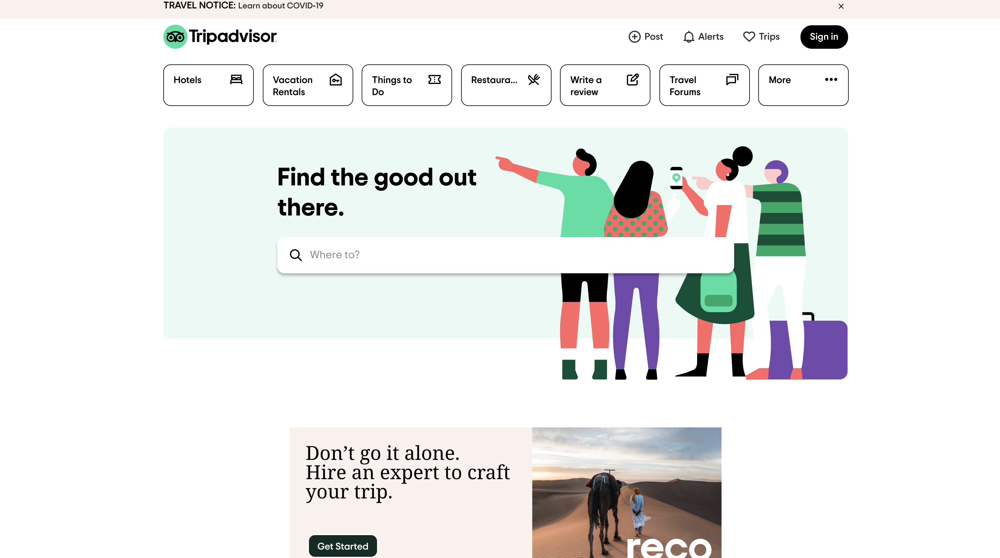

# Planning Accessible Travel Experiences
## by Gloria Rodriguez for Digital Humanities 110 (Spring 2021)
> **Project Description:** Planning a vacation with family is challenging when accessibility becomes a major issue in regards to booking experiences because a multitude of factors have to be considered since my parents are older and their stamina is declining. What makes it challenging is the lack of efficiency in regards to features and filters that are available on websites such as Airbnb and Tripadvisor. I want to make it easier for families and friends to plan a trip that is inclusive to everyone in their group by factoring in the uncommmon such as the altitude of the experience, the duration  and physical demand of the excursion, and warnings if they have a history of medical conditions. To accompish this I want to curate a website using UX design principles that integrates quick accessibility and user-friendliness across all age groups to help people plan an inclusive vacation where everyone is having fun and staying safe. 

---
#### Severity Scale 
| Number | Description |
| --- | --- | 
| 1 | Cosmetic problem only: need not be fixed unless extra time is available on project.|
| 2 | Minor usability problem: fixing this should be given low priority.|
| 3 | Major usability problem: important to fix, so should be given high priority.|
> **Source:** https://www.nngroup.com/articles/how-to-rate-the-severity-of-usability-problems/

---
### Airbnb (https://www.airbnb.com)
>**Description:** Airbnb is a booking website for vacation hotels/home rentals for travelers who are visiting local or internation destinations. It also offers the option to book a variety of local experienses hosted by members of the community rather than commercialized companies so visitors can explore the area further and support the community directly. These accomodations are available across a multitude of countries in the world. 

> **Overall Evaluation:** 

#### Heuristic Evaluation 
| Heuristics & Description | Web App Evaluation | Reccomdendation | Severity Rank |
| ---------- | ---| --- | --- |
| Visibility of the system | It is good to have the user's radio. | yuh | 5 |

---
### Tripadvisor (https://www.tripadvisor.com)
>**Description:** Tripadvisor is an online travel company that functions as a website to assist travelers with hotel reservations and vacation rentals across the world. In addition their website also provides other services such as book different types of transportation (i.e. rental cars and flights), and suggustions for popular attractions and resturants in the local area where travelers are staying. They also offer local experiences as well that are hosted by various companies. 

> **Overall Evaluation:**

#### Heuristic Evaluation 
| Heuristics & Description | Web App Evaluation | Reccomdendation | Severity Rank |
| ---------- | ---| --- | --- |
| Visibility of the system | It is good to have the user's radio. | yuh | 5 |
| Gang | Gang | Gang | Gang |
