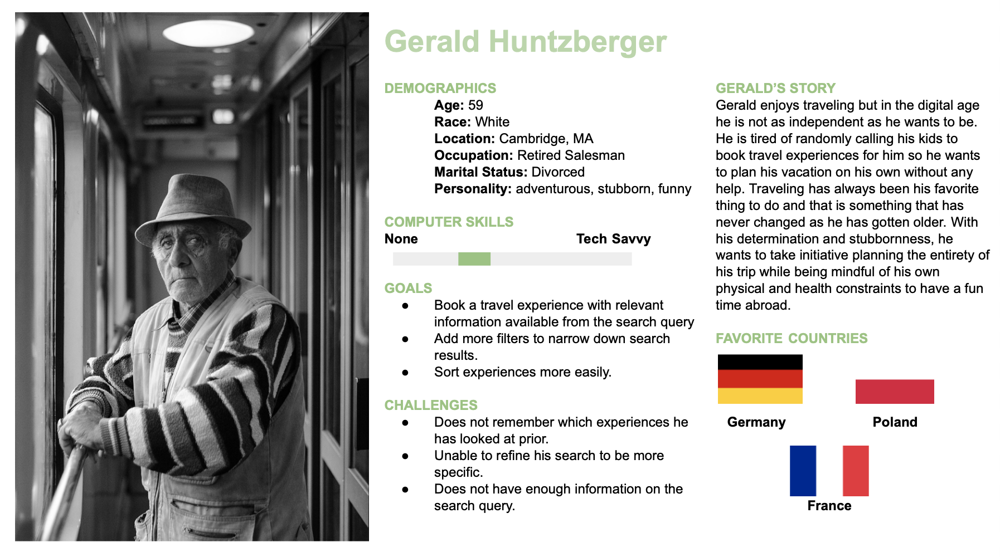

# Planning Accessible Travel Experiences
## by Gloria Rodriguez for Digital Humanities 110 (Spring 2021)

### Project Description
> Planning a vacation with family is challenging when accessibility becomes a major issue in regards to booking experiences because a multitude of factors have to be considered since my parents are older and their stamina is declining. What makes it challenging is the lack of efficiency in regards to features and filters that are available on websites such as Airbnb and Tripadvisor. I want to make it easier for families and friends to plan a trip that is inclusive to everyone in their group by factoring in the uncommmon such as the altitude of the experience, the duration  and physical demand of the excursion, and warnings if they have a history of medical conditions. To accompish this I want to curate a website using UX design principles that integrates quick accessibility and user-friendliness across all age groups to help people plan an inclusive vacation where everyone is having fun and staying safe. 

### Competitor Analysis 
> Despite having an awesome aesthetic and minimalist user-interface design because of its consistent layout and enforced standards, Airbnb fails to provide important information in regards to accessibility when searching for travel experiences. There needs to be improvement regarding the amount of visible icons, more filters to be available, and better descriptors that are easily seen to enable better efficiency.
>  The website has great visibility of system status because lets the user know when it is processing their request by providing a message and has rapid feedback when problems are occurring. Yet tripadvisor needs to develop more efficient design when users are searching for experiences because there is limited hovering functions and icons that are available. As well as too many buttons that tarnish the aesthetic of the website to enable quick accessability.

More can be found via https://github.com/rodriguezgloria/DH110/blob/main/Assignment01.md

### UX Storytelling 

More can be found via https://github.com/rodriguezgloria/DH110/blob/main/Assignment04.md

### High-Fidelity Prototype 
> Link: https://www.figma.com/proto/1Z4uOooQoil2pwlAg4809N/DH-Assignment-6?node-id=66%3A1517&scaling=scale-down&page-id=0%3A1

More can be found via https://github.com/rodriguezgloria/DH110/blob/main/Assignment06.md
